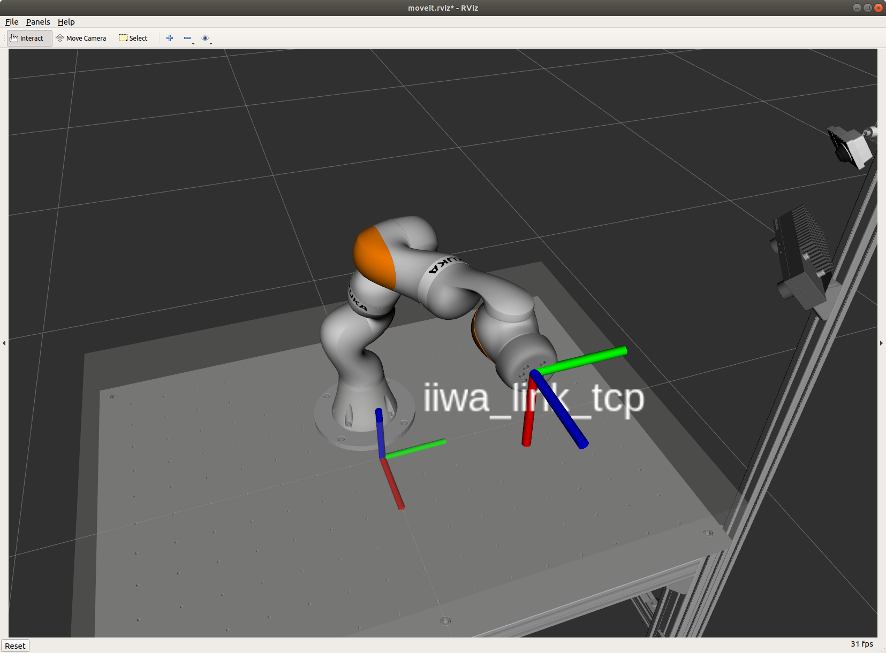

# Robot Playground Project

The Robot Playground Project contains Python and C++ examples to help you getting started with the Robot Learning Lab.

Please see the [Robot Learning Lab documentation](https://rll-doc.ipr.kit.edu/project_robot_playground.html)
for a detailed guide on how to get started or follow the quick start guide below if you are already familiar with the
Robot Learning Lab.



## Quick start

Clone the project into your catkin workspace.

### Build the project

Make sure you are in your catkin workspace directory and run the following command to build the project:

```bash
catkin build rll_robot_playground_project
```


### Run the project

Setting up the RLL environment and running your code contains four steps. Execute each command in a **new** terminal tab or window.

1. Start _rviz_ and load the robot environment:
  
   ```bash
   roslaunch rll_robot_playground_project moveit_planning_execution.launch
   ```

2. Start the `playground_iface`, which controls the robot:

   ```bash
   roslaunch rll_robot_playground_project playground_iface.launch
   ```

3. Load the project code, but don't execute it just yet. Depending on whether you want to write your code in Python or C++ run **one** of the following commands:
   - Python version:

     ```bash
     roslaunch rll_robot_playground_project move_sender.launch
     ```
   - C++ version:

     ```bash
     roslaunch rll_robot_playground_project move_sender.launch use_python:=false
     ```

4. Trigger the execution of your project code:

   ```bash
   roslaunch rll_tools run_project
   ```


### Modify the code

All example programs are included twice, once written in Python and once in C++. The C++ code can be found in the `src/` folder whereas the Python code is located in the `scripts/` directory.

If you follow the steps above the code in the file `scripts/playground.py` or `src/playground.cpp`, respectively, is executed. Therefore place your own code in these files.
